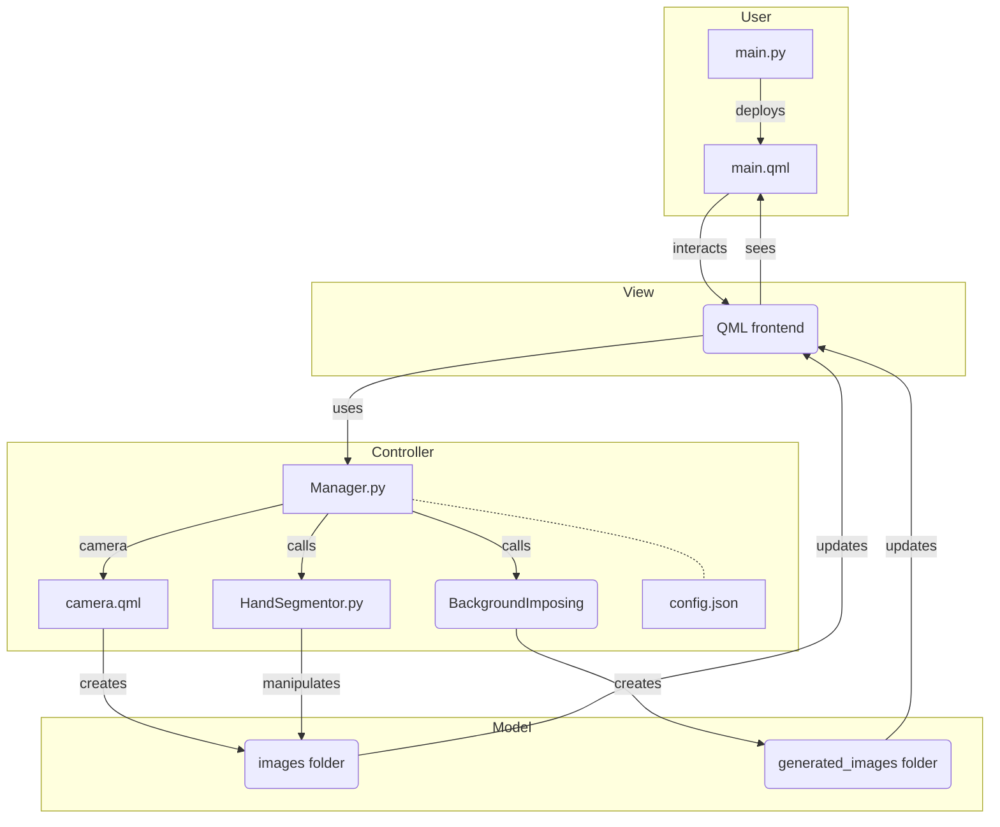

# Dataset generator

This is a simple dataset generator for ...

## Usage

```bash
python3 main.py
```

This is a desktop application, so you can see the interface.

## Dependencies

To install the dependencies, run:

```bash
pip3 install -r requirements.txt
```

## Configuration

The configuration file is `config.json`. You can change the parameters of the generator.

## Architecture

The architecture is based on the MVC pattern.

